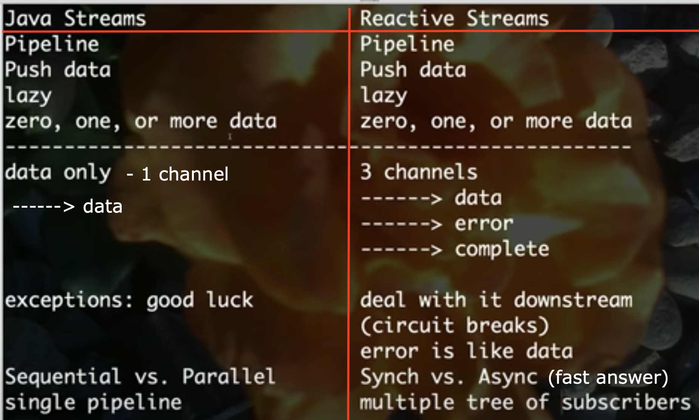

# DP_Publish_Subscribe
What is pattern publish subscribe (also known as Observer or Listener)?

Publishers  are the entities who create/publish a message on a header. 
Subscribers are the entities who subscribe  to a messages on a header.

In a header based Publish-Subscribe pattern, Publishers tag each message with the a header instead of referencing specific Subscribers. 
Messaging system then sends the message to all Subscribers who have asked to receive messages on that header.

Publishers only concern themselves with creating the original message and can leave the task of servicing the Subscribers to the messaging infrastructure (this is where pattern comes into picture).

see other reactive streams projects:
- java 9 reactive streams - https://github.com/reactive-streams/reactive-streams-jvm
- project spring reactor - https://github.com/reactor/projectreactor.io
- rxjava - https://github.com/ReactiveX/RxJava
- vertex - https://github.com/eclipse-vertx/vert.x
- akka - https://github.com/akka/akka
- https://www.youtube.com/watch?v=kG2SEcl1aMM

